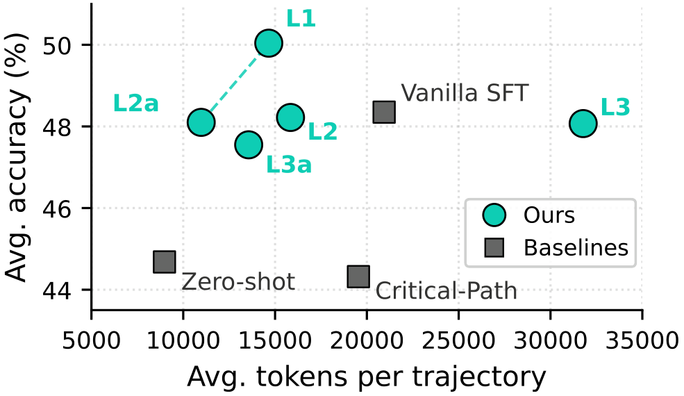
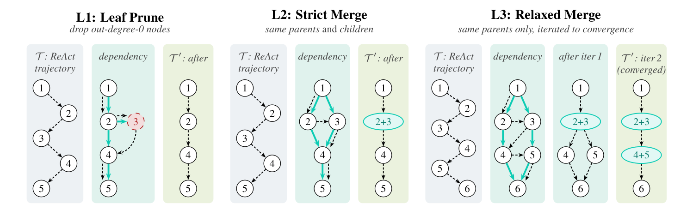

# Dependency-Aware Trajectory Refinement

Code for **[Dependency-Aware Trajectory Refinement for Efficient Multi-Turn Agent Fine-Tuning](https://arxiv.org/abs/2609.18417)**  
Zhuo Chen, Zhen Zhang, Xinyu Wang, Kewei Tu

A research fork of [LLaMA-Factory](https://github.com/hiyouga/LLaMA-Factory). Training still uses LLaMA-Factory ([upstream README](README_llamafactory.md)).

Multi-turn agent traces contain failed searches, duplicate sub-queries, and verification-only rounds that never support the final answer. We annotate a **round-level dependency DAG**, then apply deterministic edits before SFT. The student sees a shorter trajectory that still carries the load-bearing facts.

<p align="center">
  
</p>
<p align="center">
  <em><b>Figure 1.</b> Train on DAG-refined trajectories: higher accuracy, lower inference cost. <b>L1</b> sets the accuracy ceiling; <b>L2a</b> halves tokens at vanilla-SFT accuracy.</em>
</p>

<p align="center">
  
</p>
<p align="center">
  <em><b>Figure 2.</b> Three edits on a round-level dependency DAG: prune unused leaves (<b>L1</b>), merge interchangeable siblings (<b>L2</b>), or merge more aggressively by shared parents (<b>L3</b>).</em>
</p>

| Edit | Rule | Typical use |
| --- | --- | --- |
| **L1** Leaf Prune | Drop out-degree-0 rounds except the answer | Highest downstream accuracy |
| **L2** Strict Merge | Fuse siblings with the same parents *and* children | Conservative compression |
| **L3** Relaxed Merge | Fuse siblings with the same parents only, iterated | Denser merge; larger train/test format gap |
| **L2a** / **L3a** | Same merge, LLM-rewritten fused `<think>` | **L2a** is the cost-efficient operating point |

## Pipeline

```bash
# 1. Annotate round-level dependencies (writes dependency_raw)
python data_optim/one_time_prompting.py --data path/to/trajectories.jsonl --model openai/gpt-5.4

# 2. Apply a structural edit
python data_optim/level123_optim.py --data path/to/annotated.jsonl --level 1    # or 2, 3, 2a, 3a
```

**L2a** / **L3a** call an LLM to rephrase merged `<think>` blocks (`merge_think_llm.py`). **L1**–**L3** are deterministic given the DAG.

SFT configs: `examples/train_full/qwen3vl_full_sft_042*.yaml` (Vanilla, Critical-Path, **L1**–**L3a**). Dataset names are registered in `data/dataset_info.json`.

| Path | Role |
| --- | --- |
| `data_optim/` | DAG annotation and edits (`one_time_prompting.py`, `level123_optim.py`, `dag_ops.py`) |
| `data_optim_cc/` | Critical-Path deletion baseline |
| `examples/train_full/` | Full-parameter SFT yaml |

## Citation

```bibtex
@misc{chen2026dependencyawaretrajectoryrefinementefficient,
      title={Dependency-Aware Trajectory Refinement for Efficient Multi-Turn Agent Fine-Tuning}, 
      author={Zhuo Chen and Zhen Zhang and Xinyu Wang and Kewei Tu},
      year={2026},
      eprint={2609.18417},
      archivePrefix={arXiv},
      primaryClass={cs.CL},
      url={https://arxiv.org/abs/2609.18417}, 
}
```
